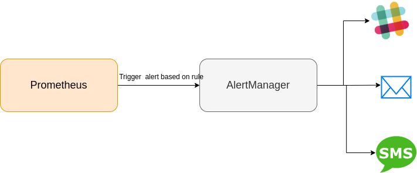

## PROMETHUES

* Promethues is an `open-source systems monitoring and alerting toolkit` with an active ecosystem.
* It is a tool that allows you to analyse how your applications and infrastructure are performing from the metrics discovered by it.
* Prometheus components are written in `Go`
* Uses a `multi-dimensional` data model with `time series data` identified by `metric name` and `key/value pairs` (called `labels`)
    * `Ex` : http_requests_total{method="POST"}
          * `http_requests_total` -> metric name
          * `method` -> key
          * `POST` -> value

#### Features
  1. Uses a very simple query language `PromQL` : Is a `read-only` and a flexible query language, that allows `aggregation across any of the labels` stored in it's time series.
  2. No reliance on distributed storage; it's single server nodes are autonomous
  3. Default libraries and servers available for Prometheus - windows, linux, mysql, etc...
  4. To monitor custom services, you can add instrumentation to your code via Prometheus client libraries like Go, Java or Scala, Python,  etc...
  5. Full-fledged monitoring system with it's own `AlertManager`

* https://prometheus.io/ (Joined the `Cloud Native Computing Foundation ([cncf](https://www.cncf.io/projects/))`). It became the second hosted project of Cloud Native after `Kubernetes`

### Monitoring tools should provide
  1. Collect or at least listen for events, typically with a timestamp
  2. Effectively store those events in storage
     *   Prometheus encodes dimensions explicitly as `key-value` pairs, called `labels`, attached to a metric name. This labelling allows easy filtering, grouping, and matching via the query language.
     *   Prometheus allows storing samples at arbitary intervals as scrapes or rule evaluations occur. New samples are simply appended.
  3. Should support querying feature.
  4. Provide a graphical monitoring

##### Prometheus Alternatives
- Graphite
- InfluxDB
- OpenTSDB
- Nagios
- `Sensu`

#### Basic Terminologies in Prometheus

* `Monitoring` : Monitoring is a systematic process of collecting and recording the activities taking place in a target project, programme or service and then using that recorded values to check if the targets are reaching their objectives or not.
* `Alert/Alerting` : An alert is the outcome of an alerting rule in Prometheus that is actively firing. `Alerts are sent from Prometheus to the AlertManager`.
* `AlertManager` : The AlertManager takes in alerts from Prometheus server, aggregates them into groups, de-duplicates, applies silences, throttles, and then sends out notifications to slack, email, PagerDuty etc..

    

* `Target` : A target is the definition of an object to scrape. Target is an object whose metrics are to be monitored.
* `Instance` : In Prometheus terms, an endpoint you can scrape is called an instance
      * Ex : 127.0.0.1:1232, 127.0.0.2:3928 (<Host>:<Port>)
* `Job` : Job is collection of targets/Instances with the same purpose
    * `Ex:` a cluster of kafka/db's/apps
* `Sample` : A sample is a single value at a point in time in a time series.
    * `Ex:` http_requests_total{method='POST'} -> 45