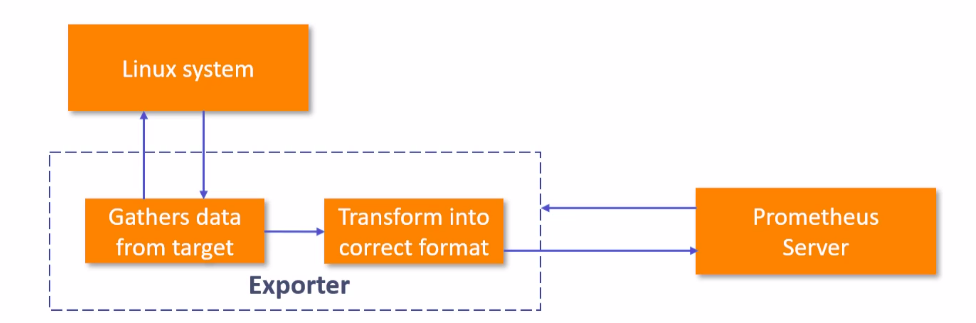

## Exporters
* An Exporter is a software or number of libraries and servers that help in exporting existing metrics from third-party systems (like Linux or Windows OS) in `the same format as of Prometheus metrics`
* Useful for cases where it is not feasible to instrument a given system with Prometheus metrics directly.



#### Let's Configure Node Exporter to have *NIX (Unix & Linux) based os metrics

1. Download and start Node Exporter (https://prometheus.io/download/#node_exporter)
2. Configure `promethues.yml` to have node exporter as targer
    * For Configurations : https://prometheus.io/docs/prometheus/latest/configuration/configuration/
    ```cfg
        scrape_configs:
           - job_name: 'prometheus'
             static_configs:
             - targets: ['localhost:9090']
           - job_name: 'node_exporter'
             static_configs:
             - targets: ['localhost:9100']
    ```
3. Start the Promethues (access on : http://127.0.0.1:9090 for UI)

* For More Exporters : https://prometheus.io/docs/instrumenting/exporters/