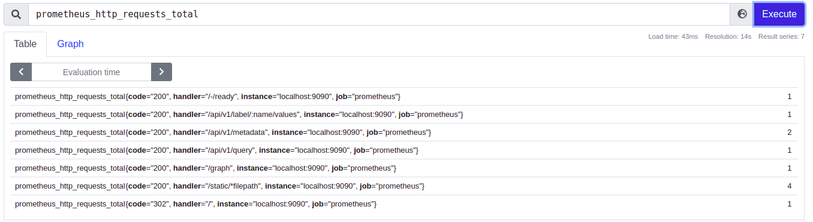
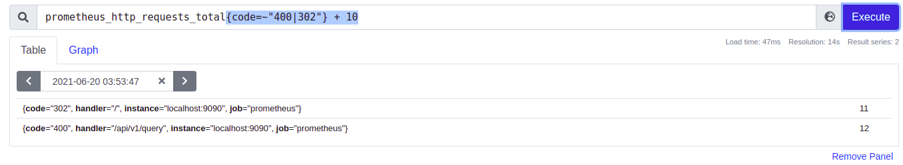

## PROM-QL

#### Data Types
* `Instant Vector` : A set of time series containing a `single sample for each time series of metric`, all sharing the same timestamp.

* `Instant vector selectors` : Instant vector selectors allow the selection of a set of time series and a single sample value for each at a given timestamp (instant): in the simplest form, only a metric name is specified. This results in an instant vector containing elements for all time series that have this metric name.



* `Range Vector` : A set of time series containing a range of data points over time for each time series of metric.
* `Range Vector Selectors` : Range vector literals work like instant vector literals, except that they select a range of samples back from the current instant. Syntactically, a time duration is appended in square brackets ([]) at the end of a vector selector to specify how far back in time values should be fetched for each resulting range vector element.


* `Scalar` : A simple numberic floating point value. `Ex : 15.21`

* `String` : A simple string value; currently `unused`. `Ex: Hello`

###### Matcher Types

* `Equality Matcher (=)` : Select labels that are exactly equal to the provided string.


* `Negative Equality Matcher (!=)` : Select labels that are not equal to the provided string


* `Regular Expression Matcher (=~)` : Select labels that `regex-match` with the provided string.


* `Negative Regular Expression Matcher (!~)` : Select labels that do not regex-match with the provided string.


* Note : Above all matchers are instant type vector matchers, matchers can work for range vector types as well


* For More Info : https://prometheus.io/docs/prometheus/latest/querying/basics/

#### Operators

##### Binary Operators
* Binary Operators are the operators that take two operands and performs the specified calculations on them.
- `Arithmetic Binary Operators` : Arithmetic operators are the symbols that represent arithmetic math operations.
    
    - `+` (addition)
    
    - `-` (subtraction)
    
    - `*` (multiplication)
    
    - `/` (division)
    
    - `%` (modulo)
    
    - `^` (power/exponentiation)
    

    * Binary arithmetic operators are defined between `scalar/scalar`, `vector/scalar`, and `vector/vector` value pairs.

    * `Between two scalars`, the behavior is obvious: they evaluate to another scalar that is the result of the operator applied to both scalar operands.

      

    * `Between an instant vector and a scalar`, the operator is applied to the value of every data sample in the vector.
      * E.g. if a time series instant vector is multiplied by 2, the result is another vector in which every sample value of the original vector is multiplied by 2. `The metric name is dropped`.

  
  

    * `Between two instant vectors`, a binary arithmetic operator is applied to each entry in the left-hand side vector and its matching element in the right-hand vector.
      * The result is propagated into the result vector with the grouping labels becoming the output label set.
      * The metric name is dropped. Entries for which no matching entry in the right-hand vector can be found are not part of the result.
        * Have a look @ `Vector Matching section`

- `Comparison Binary Operators` :

    
    * The following binary comparison operators exist in Prometheus:
       - == (equal)
    
       - != (not-equal)
    
       - `>` (greater-than)
    
       - < (less-than)
    
       - `>=` (greater-or-equal)
    
       - <= (less-or-equal)
    

    * Comparison operators are defined between scalar/scalar, vector/scalar, and vector/vector value pairs.
    * By default they filter.
    * Their behavior can be modified by providing bool after the operator, which will return 0 or 1 for the value rather than filtering.

    * `Between two scalars`:  the bool modifier must be provided and these operators result in another scalar that is either 0 (false) or 1 (true), depending on the comparison result.

    * `Between an instant vector and a scalar`:
      * These operators are applied to the value of every data sample in the vector, and vector elements between which the comparison result is false get dropped from the result vector.
      * If the bool modifier is provided, vector elements that would be dropped instead have the value 0 and vector elements that would be kept have the value 1. The metric name is dropped if the bool modifier is provided.

    * `Between two instant vectors`:
      * These operators behave as a filter by default, applied to matching entries.
      * Vector elements for which the expression is not true or which do not find a match on the other side of the expression get dropped from the result, while the others are propagated into a result vector with the grouping labels becoming the output label set.
      * If the bool modifier is provided, vector elements that would have been dropped instead have the value 0 and vector elements that would be kept have the value 1, with the grouping labels again becoming the output label set. The metric name is dropped if the bool modifier is provided.

- `Logical/Set Binary Operators`

    * These logical/set binary operators are `only defined between instant vectors`:

    * Vector 1 :
        
    * Vector 2:
        

      - `and (intersection)` :
        * `vector1 and vector2` results in a vector consisting of the elements of vector1 for which there are elements in vector2 with `exactly matching label sets`.
        * Other elements are dropped. The metric name and values are carried over from the left-hand side vector.
        

      - `or (union)` :
        *  `vector1 or vector2` results in a vector that contains all original elements (label sets + values) of vector1 and additionally all elements of vector2 which do not have matching label sets in vector1.
        

      - `unless (complement)`:
        * `vector1 unless vector2` results in a vector consisting of the elements of vector1 for which there are no elements in vector2 with exactly matching label sets.All matching elements in both vectors are dropped.
        


###### Vector matching

* Operations between vectors attempt to find a matching element in the right-hand side vector for each entry in the left-hand side.
* There are two basic types of matching behavior:
    - `One-to-one` :
        * `One-to-one vector matches` finds a unique pair of entries from each side of the operation.
        * In the default case, that is an operation following the format `vector1 <operator> vector2`. 
        * Two entries match if they have the exact same set of labels and corresponding values. 
        * The `ignoring` keyword allows ignoring certain labels when matching, while the `on` keyword allows reducing the set of considered labels to a provided list:
        ```pql
            <vector expr> <bin-op> ignoring(<label list>) <vector expr>
            <vector expr> <bin-op> on(<label list>) <vector expr>
        ```
        

    - `many-to-one/one-to-many`:
        * `Many-to-one and one-to-many vector matches` refer to the case where each vector element on the "one"-side can match with multiple elements on the "many"-side.
        *  This has to be explicitly requested using the `group_left or group_right` modifier, where left/right determines which vector has the higher cardinality.
        ```pql
            <vector expr> <bin-op> ignoring(<label list>) group_left(<label list>) <vector expr>
            <vector expr> <bin-op> ignoring(<label list>) group_right(<label list>) <vector expr>
            <vector expr> <bin-op> on(<label list>) group_left(<label list>) <vector expr>
            <vector expr> <bin-op> on(<label list>) group_right(<label list>) <vector expr>
        ```
        * The label list provided with the group modifier contains additional labels from the "one"-side to be included in the result metrics. For on a label can only appear in one of the lists. Every time series of the result vector must be uniquely identifiable.
        * Grouping modifiers can only be used for comparison and arithmetic. Operations as `and, unless and or` operations match with all possible entries in the right vector by default.

##### Aggregation Operators
* Prometheus supports the following built-in aggregation operators that can be used to aggregate the elements of a single instant vector, resulting in a new vector of fewer elements with aggregated values:
  - sum (calculate sum over dimensions)
  - min (select minimum over dimensions)
  - max (select maximum over dimensions)
  - avg (calculate the average over dimensions)
  - group (all values in the resulting vector are 1)
  - stddev (calculate population standard deviation over dimensions)
  - stdvar (calculate population standard variance over dimensions)
  - count (count number of elements in the vector)
  - count_values (count number of elements with the same value)
  - bottomk (smallest k elements by sample value)
  - topk (largest k elements by sample value)
  - quantile (calculate φ-quantile (0 ≤ φ ≤ 1) over dimensions)
* These operators can either be used to aggregate over all label dimensions or preserve distinct dimensions by including a without or by clause. These clauses may be used before or after the expression.
```
  <aggr-op> [without|by (<label list>)] ([parameter,] <vector expression>)
  or
  <aggr-op>([parameter,] <vector expression>) [without|by (<label list>)]
```

* For More Info On Aggregation : https://prometheus.io/docs/prometheus/latest/querying/operators/
* Information on Functions : https://prometheus.io/docs/prometheus/latest/querying/functions/
* Information on HTTP API : https://prometheus.io/docs/prometheus/latest/querying/api/